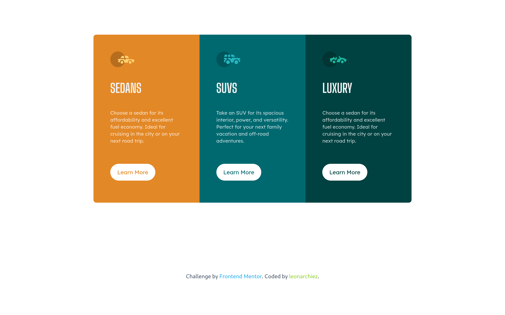

# Frontend Mentor - 3-column preview card component solution

This is a solution to the [3-column preview card component challenge on Frontend Mentor](https://www.frontendmentor.io/challenges/3column-preview-card-component-pH92eAR2-). Frontend Mentor challenges help you improve your coding skills by building realistic projects. 

## Table of contents

- [Overview](#overview)
  - [The challenge](#the-challenge)
  - [Screenshot](#screenshot)
  - [Links](#links)
- [My process](#my-process)
  - [Built with](#built-with)
  - [What I learned](#what-i-learned)
  - [Continued development](#continued-development)
  - [Useful resources](#useful-resources)
- [Author](#author)
- [Acknowledgments](#acknowledgments)

## Overview

### The challenge

Users should be able to:

- View the optimal layout depending on their device's screen size
- See hover states for interactive elements

### Screenshot

### Links

- Solution URL: [Github](https://github.com/leonarchiez/3-column-preview-card-component)
- Live Site URL: [Netlify](https://leonarchiez-3column-preview-component.netlify.app/)

## My process

### Built with

- Semantic HTML5 markup
- TailwindCss
- Flexbox
- Mobile-first workflow

### What I learned

I learn to use flexbox as possible i can and i learn mobile-first design workflow

To see how you can add code snippets, see below:

### Continued development

Still confused about css grid and i learn that i can use css grid if flexbox still not help to solved the layout.

### Useful resources

- [Example resource 1](https://tailwindcss.com) - This official docs helped me a lot to use tailwindcss. I probably recommended to learn tailwindcss by its official docs.

## Author

- Website - [Github](https://github.com/leonarchiez)
- Frontend Mentor - [@akhdrzki](https://www.frontendmentor.io/profile/akhdrzki)

